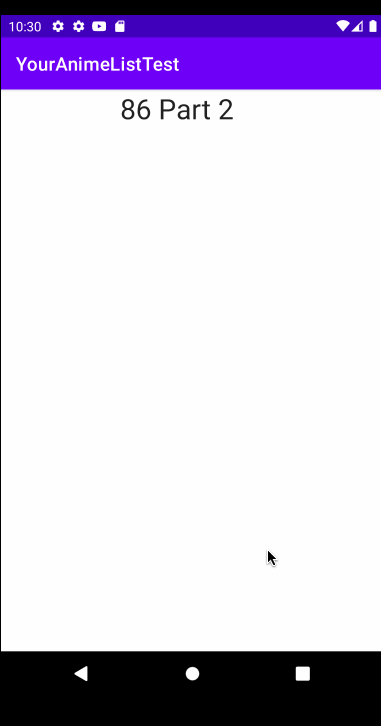

# YourAnimeList

## Table of Contents
1. [Overview](#Overview)
1. [Product Spec](#Product-Spec)
1. [Wireframes](#Wireframes)
2. [Schema](#Schema)

## Overview
### Description
[Description of your app]

### App Evaluation
[Evaluation of your app across the following attributes]
- **Category:**
- **Mobile:**
- **Story:**
- **Market:**
- **Habit:**
- **Scope:**

## Product Spec

### 1. User Stories (Required and Optional)

**Required Must-have Stories**

- [x] User can create a profile with username and password through Back4App
- [ ] User can sign out and log in
- [ ] User can add anime to their list
- [ ] User can rate anime on a scale of 1-10
- [ ] User can delete anime from their list
- [ ] User can search for anime using MyAnimeListAPI
- [ ] User can change the status of the anime (watching, completed, plan-on watching)
- [ ] Have a navigation bar for separate tabs
- [x] User can see suggested anime
- [x] Show a home screen of seasonal recommendation anime from MyAnimeListAPI

**Optional Nice-to-have Stories**
- [ ] User can set a profile picture
- [ ] User can change their username

### Walkthroughs
Sprint 1:

Sprint 2:

Sprint 3: 

### 2. Screen Archetypes

* [list first screen here]
   * [list associated required story here]
   * ...
* [list second screen here]
   * [list associated required story here]
   * ...

### 3. Navigation

**Tab Navigation** (Tab to Screen)

* [fill out your first tab]
* [fill out your second tab]
* [fill out your third tab]

**Flow Navigation** (Screen to Screen)

* [list first screen here]
   * [list screen navigation here]
   * ...
* [list second screen here]
   * [list screen navigation here]
   * ...

## Wireframes

### [BONUS] Digital Wireframes & Mockups

### [BONUS] Interactive Prototype

## Schema 

### Models
| Property      | Type          | Description  |
| ------------- |:-------------:| -----:|
| picture      | File | picture of anime |
| animeTitle      | String | name of anime |
| epTitle      | String | name of episode |
| synopsis      | String      |   summary of anime/episode |
| released | DateTime      |    date anime/episode released |
| rating | number      |    rating for anime |

### Networking
##### MyAnimeListAPI
- Base URL - [https://myanimelist.net/apiconfig/references/api/v2](https://myanimelist.net/apiconfig/references/api/v2)

   HTTP Verb | Endpoint | Description
   ----------|----------|------------
    `GET`    | /anime | get all anime
    `GET`    | /anime/?name=name | return specific details for anime
